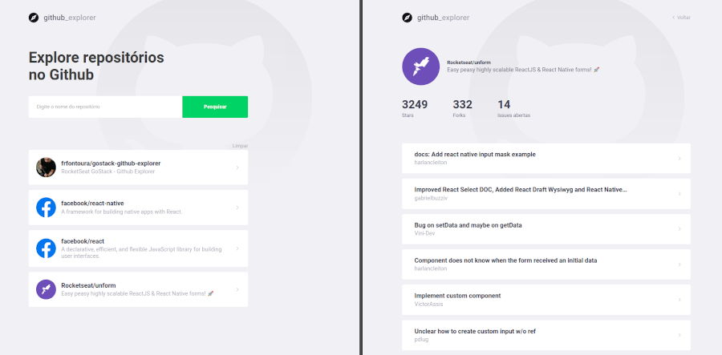

# Github Explorer

Este é um projeto desenvolvido no GoStack Bootcamp da RocketSeat, onde o usuário pode buscar um autor/repositório e navegar até uma página com as issues abertas.



## Requisitos

* NodeJs - (desenvolvido utilizando a versão v12.16.2)
* Yarn - (opcional - versão 1.22.4)

## Instalação

1 - Fazer o gitclone:

```
git clone https://github.com/frfontoura/gostack-github-explorer
```

2 - Instalar as dependências:
```
yarn
```

3 - Inicializar o servidor:
```
yarn start
```
